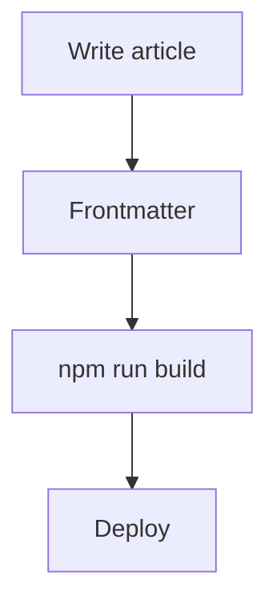

import Callout from '../components/Callout.astro';
import CodeCompare from '../components/CodeCompare.astro';

This page is not part of the blog. It carries a `noindex` tag and is intentionally left out of the main navigation, RSS, and the sitemap — it exists so a returning maintainer, or an AI coding agent, can recover the site's real state quickly. Because `noindex` only keeps it out of search results, not out of anyone's browser, nothing sensitive belongs on this page.

## Quick Start

This page is the current source of truth for how this site is built, styled, and maintained. `docs/site-brief.md`, `docs/roadmap.md`, and `docs/design/README.md` are historical planning documents from earlier phases — useful for background, but superseded by this guide wherever the two disagree.

**Install and run**

```bash
npm ci
npm run dev
```

Local dev serves at `http://localhost:4321/`. Production is https://momoalison.github.io/.

**Before considering a change done**

```bash
npm run check        # Astro + TypeScript
npm run test:content # Isolated Markdown/MDX fixture build; never publishes fixtures
npm run build         # Production output in dist/
npm test              # Validates routes, links, anchors, sitemap, and page-level scripts
npm run preview       # Serve the production build locally
```

These are the same checks CI runs, in the same order — see "Deployment & Production."

**Where content lives**

- Notes: `src/content/blog/notes/`
- Essays: `src/content/blog/essays/`

See "Writing a New Article" below for the exact frontmatter schema and authoring rules.

## Design System

All design tokens are CSS custom properties defined once, in `src/styles/global.css`, under `:root`. There is no separate token package or theme file — that stylesheet is the only source, and the swatches below read their color directly from it, so they stay accurate if the tokens ever change.

### Color

| Swatch | Token | Value | Used for |
|---|---|---|---|
| <span class="guide-swatch guide-swatch--background" aria-hidden="true" /> | `--background` | `#faf8f3` | Page background |
| <span class="guide-swatch guide-swatch--surface" aria-hidden="true" /> | `--surface` | `#f2efe8` | Tag pills, inline code background, table header row |
| <span class="guide-swatch guide-swatch--text" aria-hidden="true" /> | `--text` | `#242624` | Primary text |
| <span class="guide-swatch guide-swatch--secondary" aria-hidden="true" /> | `--secondary` | `#686862` | Muted text, meta, captions |
| <span class="guide-swatch guide-swatch--border" aria-hidden="true" /> | `--border` | `#dedcd4` | All hairline borders |
| <span class="guide-swatch guide-swatch--accent" aria-hidden="true" /> | `--accent` | `#396966` | Links, active states, blockquote rule |
| <span class="guide-swatch guide-swatch--accent-soft" aria-hidden="true" /> | `--accent-soft` | `#e8eeea` | Callout background, "Notes" pill background |

Light mode only — see "Approved Design Decisions."

### Typography

- Body — `--font-body`, a system sans stack (`-apple-system, BlinkMacSystemFont, "Segoe UI", sans-serif`).
- Editorial — `--font-editorial`, a Georgia/Times serif, used sparingly: the wordmark, empty-state headings, and About's closing line.
- Code — `--font-code`, a system monospace stack.

<p class="guide-editorial-sample">Same curiosity, just bigger questions.</p>

That line above is real site copy (About's closing line), rendered live in `--font-editorial` — not a mockup.

Heading scale, from `global.css`:

| Element | Size | Weight | Letter-spacing |
|---|---|---|---|
| h1 | `clamp(2.6rem, 4.7vw, 4.25rem)` | 550 | -.055em |
| h2 | 1.55rem site-wide, 1.8rem inside article prose | 550 | -.025em |
| h3 | 1.25rem site-wide, 1.4rem inside article prose | 550 | -.02em |

Body text is 16px at 1.65 line-height. Article prose (this page included) is 1.05rem at 1.85 line-height for longer reading. This section's own heading is a live `h2`, and "Typography" above it is a live `h3` — both are rendered with the values in the table, not a screenshot of them.

### Spacing scale

| Token | Value |
|---|---|
| `--space-1` | .5rem |
| `--space-2` | 1rem |
| `--space-3` | 1.5rem |
| `--space-4` | 2rem |
| `--space-5` | 3rem |
| `--space-6` | 5rem |

### Layout

| Token / breakpoint | Meaning |
|---|---|
| `--width-page` (1160px) | Header, footer, and hero shell width |
| `--width-reading` (680px) | Article prose column and article header width |
| `--radius` (5px) | Buttons, code blocks, bordered panels (pills use a separate 999px radius) |
| 900px | Main responsive breakpoint (About hero, header sizing, Topics layout) |
| 600px | Small-mobile breakpoint (hero stacks fully, header shrinks) |
| 1104px | Article-only breakpoint where the full sidebar TOC collapses into the compact outline rail |

## Writing a New Article

### Notes vs Essays

`collection` is one of two values and describes the *kind* of writing:

- `notes` — course notes, structured learning notes, reference material.
- `essays` — personal technical analysis, comparisons, reflections.

Directories mirror this, but the directory itself is not what Astro reads — `collection` in frontmatter is the actual source of truth:

- `src/content/blog/notes/`
- `src/content/blog/essays/`

### Frontmatter

The schema lives in `src/content.config.ts` and is enforced at build time with Zod — a post with invalid frontmatter fails the build, not the browser.

```yaml
---
title: "Your real article title"
description: "Optional short summary"
published: 2026-09-16
collection: notes
tags: [Programming, TypeScript]
draft: false
---
```

- `title` — required, non-empty.
- `description` — optional; used in the article header, listings, and OG/Twitter meta.
- `published` — required, parsed as a date. Sorting is newest-first; a future date does not schedule anything — use `draft` instead.
- `collection` — required, `notes` or `essays`.
- `tags` — optional, defaults to empty; must be case-insensitively unique within the article.
- `draft` — optional, defaults to `false`. `true` removes the post from every listing, from Topics, and from RSS, and the route itself is never generated — not even in development.

### Filenames and URLs

A file's path under `src/content/blog/` becomes its URL: `notes/example.md` becomes `/blog/notes/example/` (trailing slash always included). Filenames determine the URL directly, so treat them as stable once published — renaming a file changes its live URL.

### Tags stay simple, on purpose

Tags are read straight from frontmatter and counted at build time (`getTopicCounts` in `src/lib/blog.ts`). There is no central tag registry, no alias list, and no normalization beyond case-insensitive uniqueness. If two tags are really the same concept spelled differently, that's a frontmatter typo to fix by hand in the article — not something the system reconciles automatically. Do not build tag-alias infrastructure for this; fix it at the source.

## Supported Content

| Feature | Author with | MDX only? | Client JS? | Notes |
|---|---|---|---|---|
| Headings | `##` / `###` | No | No | h2/h3 only — they get an anchor link and a TOC entry. h1 is reserved for the layout. |
| Paragraphs, emphasis, links | Standard Markdown | No | No | — |
| Images | `` | No | No | Prefer local relative images so Astro can process them; root-relative paths like `/images/...` also work. |
| Inline code | `` `code` `` | No | No | — |
| Fenced code | ```` ```lang ```` | No | No¹ | Highlighted with Shiki at build time — see the live demo below. |
| Copy button | Automatic | No | Yes¹ | Every rendered code block gets one automatically — see "Article Features." |
| Tables | GFM pipe tables | No | No | Wrapped in a scrollable container so a wide table never overflows the page. |
| Blockquotes | `>` | No | No | Serif, accent-colored rule. |
| Lists | `-` / `1.` | No | No | — |
| `Callout` | Component import | Yes | No | Import from `src/components/Callout.astro`; `variant` is `note` (default), `tip`, or `warning`. |
| `CodeCompare` | Component import | Yes | No | Import from `src/components/CodeCompare.astro`. Vertical layout only — see below. |
| Mermaid | ```` ```mermaid ```` | No² | No | Rendered to static SVG at build time — needs Chromium during the build, see "Troubleshooting." |
| Other MDX components | Component import | Yes | Depends | Anything under `src/components/` can be imported the same way as `Callout`/`CodeCompare`. |

¹ The fenced code block itself needs no client JS to render or highlight — that happens at build time. The Copy button is real client JS, covered in "Article Features."
² Mermaid fences work in plain `.md` files too — no component import needed.

### Code

```typescript
// Vitesse Light's comment token is overridden to #757575 for readability.
export function formatDate(date: Date) {
  return date.toISOString();
}
```

### Callout

<Callout title="Note">
The default variant — a small aside that doesn't interrupt reading.
</Callout>

<Callout title="Tip" variant="tip">
Use `variant="tip"` for a lighter, optional suggestion.
</Callout>

<Callout title="Warning" variant="warning">
Use `variant="warning"` sparingly — it swaps the accent for a neutral tone so it doesn't compete with real emphasis.
</Callout>

### CodeCompare

`CodeCompare` is a general two-code comparison component, not a Python/TypeScript-only widget. Its default labels are `TypeScript` / `Python`, overridable through `titleLeft` / `titleRight`. The one article that uses it today (`python-for-frontend-engineers.mdx`) conventionally compares JS/TypeScript on the left against Python on the right — that's a convention in that article, not a rule the component enforces.

The protected part is the layout: **`CodeCompare` stacks vertically, not side by side.** Inside a 680px reading column, two real code columns side by side would either wrap badly or force horizontal scrolling on every line. Do not reintroduce a side-by-side variant for the article width.

<CodeCompare titleLeft="TypeScript" titleRight="Python" caption="Keyword-style arguments">
<Fragment slot="left">

```typescript
function greet(name: string) {
  console.log(`Hi, ${name}`);
}
greet('Ada');
```

</Fragment>
<Fragment slot="right">

```python
def greet(name):
    print(f"Hi, {name}")

greet(name='Ada')
```

</Fragment>
</CodeCompare>

### Mermaid



This diagram is not a screenshot — it rendered through the real build-time pipeline (`rehype-mermaid` plus headless Chromium), so if it's visible here, that pipeline is working.

### Table

| Field | Required |
|---|---|
| `title` | Yes |
| `published` | Yes |
| `collection` | Yes |
| `description`, `tags`, `draft` | No |

### Blockquote

> Calm, content-first reading, with small moments of personality where they earn their place.

## Page Contracts

Structural and behavioral contracts worth protecting — not a full implementation walkthrough. Read the linked source files for exact code.

### Home

`src/pages/index.astro`

- Hero (eyebrow, h1, description, two CTAs), the latest three published posts as small editorial tiles (`src/components/HomeWritingCards.astro` — Home-only, not shared with Blog), and an About-transition strip.
- The tiles are a whole-card link (a stretched-link pattern: the real `<a>` wraps only the title for a sensible accessible name; a `::after` extends its hit area to the full card) — never a second, nested link. Column count is set per render from the real post count so 1–2 posts never leave a hard-coded empty column.
- This is intentionally different from the Blog index's plain list — see "Blog" below. Do not turn Blog into cards to "match" Home, and do not merge `HomeWritingCards` back into `PostList` just because the data shape is the same.
- The character illustration (`public/images/character.svg`) is inlined so its eyes and hair can be targeted by CSS/JS.
- Eye tracking only runs when the pointer is fine (`hover: hover` and `pointer: fine`) and `prefers-reduced-motion` is not set — it is skipped entirely on touch devices.
- Hair sway and the coffee-steam animation are pure CSS keyframes; they need no JS and already respect the site-wide reduced-motion rule.
- Without JS, or with reduced motion, the illustration still renders fully formed and static — the interaction is additive, never required.

### About

`src/pages/about.astro`

- Intro, "My path" steps, interest pills, and a Background summary are always visible.
- The Work-Experience timeline (`src/data/work.ts`) is hidden by default behind a "More / Less" toggle.
- Once expanded, a small script drives one "how many entries are active" count, set by either scroll position or a hover/focus preview on a timeline entry — whichever is currently active wins, so there is one rendering path, not two competing ones.
- The `sayhi.svg` character is decorative (`aria-hidden="true"`, no tab stop, no interactive role) even though clicking it plays a one-shot wave animation, replayed on every click, respecting `prefers-reduced-motion`.

### Blog

`src/pages/blog/index.astro`

- An editorial list of posts, not a card grid — deliberately.
- The All / Notes / Essays filter is pure CSS (`:has()` on radio inputs); it needs no JS to work.
- Topics are derived entirely from published-article tags at build time (`getTopicCounts`), sorted by count descending, then alphabetically on ties — there is no manually maintained topic list.
- Clicking a Topic layers a JS filter on top of the CSS collection filter; the two AND together — a post must match both the active collection and the active topic to stay visible.
- An empty-state message is hidden by default and only shown once both filters together exclude every post.
- On narrow screens, Topics moves above the post list instead of sitting in the right rail.

### Article

`src/layouts/ArticleLayout.astro`

- Reading column is fixed at 680px (`--width-reading`).
- A table of contents renders only when an article has more than one h2/h3 — see "Article Features" for its exact behavior.
- Code, `CodeCompare`, `Callout`, Mermaid, and the Copy button all work the same way here as described in "Supported Content" and "Article Features."

## Article Features

### Table of contents

- Built from real h2/h3 headings; renders only when there's more than one.
- Two representations share the same data: a full sidebar list (desktop, sticky) and a collapsible compact outline rail (native `<details>` — no JS needed to open or close it) that replaces the sidebar below 1104px.
- A small scrollspy script (`IntersectionObserver`, with a passive scroll-listener fallback) highlights the section currently being read across both representations. It's genuinely optional client JS — without it, the TOC is still a complete, working list of real links.
- On the full desktop sidebar only, the sticky TOC (`.article-toc`) has its own `max-height`/`overflow-y: auto`, so a long article's TOC scrolls independently of the page. When the active heading changes, the script nudges *only* `.article-toc`'s own `scrollTop` — just enough to bring the newly active link back into view if it isn't already, never centering it and never touching page scroll. It never fights a manual TOC scroll: it only acts on a genuine active-item change. Below 1104px `.article-toc` switches to `overflow: visible`, so this is a natural no-op there — the compact rail/panel is unaffected.
- This Site Guide reuses the exact same component (`src/components/ArticleToc.astro`) for its own "On this page" navigation. The machinery only depends on headings, never on blog data, so sharing it here added no coupling to blog metadata.

### Back to top

- A small fixed `<button aria-label="Back to top">` (`src/components/BackToTop.astro`), used by `ArticleLayout` and this guide only — not Home, About, Blog, or 404.
- Hidden until the page has scrolled past roughly one viewport (700px), then fades in; click scrolls to top, smoothly unless `prefers-reduced-motion` is set, in which case it jumps instantly.
- Same tiny idiom as the TOC scrollspy: a passive, rAF-throttled scroll listener toggling one `hidden` attribute. ~257 B gzip.

### Code and Copy

- Syntax highlighting is Shiki, on a cloned Vitesse Light theme (`src/lib/shiki-theme.mjs`) with only the comment color overridden — from the stock `#a0ada0` to `#757575`. Everything else in the theme is untouched. The code demo above renders with this exact theme.
- Every rendered code block gets a Copy button automatically, added at build time by `src/lib/editorial-markdown.mjs` — this is not conditional on whether the article "wants" one.
- The button starts `hidden` in the markup; a small shared script (`src/components/CopyButtonScript.astro`, used by both `ArticleLayout` and this guide) reveals every Copy button on the page and wires one delegated click handler. Measured at roughly 387 B gzip.
- Every page that uses `ArticleLayout`, or this guide's layout, loads that script — including an article with no code blocks at all. On such a page the script simply finds zero buttons and does nothing; that means "zero effect," not "zero copy-script bytes shipped."
- There is no live code compiler or playground anywhere on the site. Code blocks are highlighted text, not executable.

### Mermaid build pipeline

- Diagrams are rendered to static SVG at build time by `rehype-mermaid`, using headless Chromium via Playwright — nothing Mermaid-related ships to the browser.
- A native `popover` (no JS) lets a reader enlarge a diagram; opening and closing it uses the browser's built-in popover behavior.

## Character & SVG Rules

- Home uses `public/images/character.svg` (eyes, a hair lock, and two steam strokes are individually animatable).
- About uses `public/images/sayhi.svg` (two hands and their motion-lines are individually animatable).
- Both are inlined into the page (via `src/components/InlineSvg.astro`) rather than referenced with an `` tag, specifically so CSS and the small page scripts can target internal groups by a `data-*` attribute.

**Do not casually optimize, redraw, normalize, or structurally rewrite either SVG's geometry.** The animated pieces (hair lock, hands, steam, eyes) are cut from the original artwork by careful path partitioning: the original "ink" path is preserved whole and reused via `<use>`, and each moving piece is a clip of that same ink rather than a separately redrawn shape. This is what keeps the moving piece and the static base visually seamless at every frame.

This isn't just a convention — it's enforced. `scripts/verify-build.mjs` hashes the exact `d` attribute of each original ink path (SHA-256) and fails the build if the geometry changes, along with checks that each animated group appears exactly once. A generic "SVG optimizer" pass, a redraw, or a well-intentioned cleanup will very likely break this hash and fail CI — that's the intended outcome, not a bug in the check.

Only touch these two files when a visual change to the character is explicitly requested, and run `npm test` before considering the change done.

## Static-First Architecture

The site builds to static HTML (`output: 'static'`) with no client framework anywhere — no React, Vue, Svelte, or Astro island hydration. `scripts/verify-build.mjs` actively checks for the absence of `<astro-island>` on every page type, so this isn't just a stated preference.

Client JS exists only where an interaction earns it, and is small, page-scoped vanilla TypeScript in every case:

| Page | Script | Purpose |
|---|---|---|
| Home | Eye tracking | Pointer-following glance, fine-pointer and motion-safe only |
| About | Timeline + wave | More/Less toggle, scroll/hover progress, one-shot wave |
| Blog index | Topics filter | ANDs with the CSS collection filter |
| Article / Site Guide | TOC scrollspy | Only when a TOC renders (more than one h2/h3); also reveals the active link inside the sticky TOC's own scroll |
| Article / Site Guide | Copy button | Always loaded; no-ops if there are no code blocks |
| Article / Site Guide | Back to top | Always loaded; hidden until ~700px of scroll |

Every other page ships zero scripts — enforced per page by `scripts/verify-build.mjs`, not just documented.

Mermaid is the other build-time-only piece: diagrams render to static SVG using headless Chromium during `astro build`, so nothing Mermaid-related reaches the browser.

## Approved Design Decisions

These are intentional decisions, not accidental current-state details. Future changes should have a concrete reason, not just be a passing preference.

- Main navigation is Home, Blog, About — nothing else.
- No `/resume/` page, no `/work/` page, no public CV/PDF download. A concise work history lives inline on About instead. This is a current decision, not a deferred future phase.
- Light mode only.
- Warm cream background, editorial/Notion-inspired restraint, generous whitespace, near-black text, a single muted blue-green accent.
- No gradients, no glassmorphism, minimal shadows.
- Blog is a plain editorial list — not a card wall.
- Article reading width is fixed around 680px.
- `CodeCompare` stacks vertically; it does not become a side-by-side layout inside the article column.
- Syntax theme is Vitesse Light, with comments overridden to `#757575` for contrast.
- Mermaid is build-time only — never a client-side Mermaid runtime.
- Topics are derived from article frontmatter, never a hand-maintained list.
- Character SVG geometry is protected — see "Character & SVG Rules."
- Static-first, minimal client JS, no framework hydration.

## Deployment & Production

- Production: https://momoalison.github.io/ — a GitHub Pages **user site**, served from the repository root. `astro.config.mjs` sets `site`, `base: '/'`, and `trailingSlash: 'always'` accordingly. Never introduce a project-site-style base path (a repository-name prefix); this is not a project site.
- Deploys via `.github/workflows/deploy.yml` on push to `main` (or manual dispatch): install → install Chromium for Mermaid → `npm run check` → `npm run test:content` → `npm run build` → `npm test` → upload and deploy `dist/`.
- Every page gets a canonical URL and OG/Twitter meta from `src/layouts/BaseLayout.astro`, sharing one social image (`public/og-image.png`) and favicon (`public/favicon.png`).
- RSS (`src/pages/rss.xml.ts`) and the sitemap (`@astrojs/sitemap`) are both generated automatically from published content. A non-blog page like this guide is excluded from RSS by construction — it isn't in the blog collection — and is explicitly excluded from the sitemap by a `filter` in `astro.config.mjs`.
- `public/robots.txt` allows indexing site-wide; this guide relies on its own `noindex` meta tag, not on robots.txt, to stay out of search results.
- The 404 page (`src/pages/404.astro`) is the only other `noindex` page besides this guide.

## Troubleshooting

**Dev server shows stale output after a build-pipeline change.** After editing `astro.config.mjs`, the Shiki theme (`src/lib/shiki-theme.mjs`), the rehype/markdown plugin (`src/lib/editorial-markdown.mjs`), or other build-time pipeline code, restart `npm run dev` before assuming the change didn't work — this has been observed during development.

**Mermaid fails locally or in a fresh environment.** `rehype-mermaid` renders diagrams using headless Chromium via Playwright. If a `mermaid` fence fails to build, install it: `npx playwright install --with-deps chromium` — this is exactly what CI runs before `npm run build`.

**A known, non-blocking warning.** The isolated fixture build (`npm run test:content`) emits an upstream Vite warning about Astro's `use astro:head-inject` directive. It does not indicate a real problem — rendered MDX, styles, and static output are verified regardless.

**Base path.** Production is a root GitHub Pages user site. If you ever see a project-site-style path prefix (a repository-name segment) in a generated URL, something is misconfigured — `scripts/verify-build.mjs` actively fails the build if that ever happens.

**Isolated content fixtures.** `npm run test:content -- --keep` builds the Markdown/MDX test fixtures into a temporary directory and prints its path, useful for visually inspecting article-layout changes without touching real content. Never deploy that directory — it holds private fixture text, not real posts.

## Deferred Ideas

Not currently implemented; reconsider only when actual content or a real use case justifies it. None of these are planned commitments.

- Search
- A roadmap or Obsidian-style graph view of content
- A live code compiler / playground
- Dark mode
- `series` frontmatter, for grouping multi-part posts
